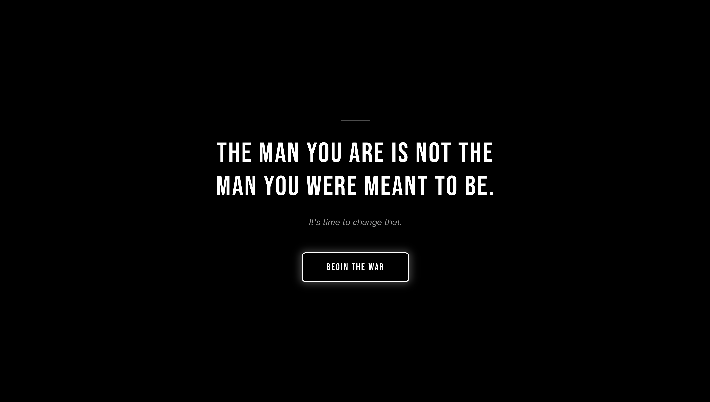

# HabitQuest

A gamified habit tracking app that helps you break bad habits and build good ones through a 66-day journey system.



## Features

- **66-Day Journey System** - Based on habit formation science with four phases: Fragile, Building, Locked In, and Forged
- **Demons & Powers** - Track habits to quit (Demons) and habits to build (Powers)
- **Four Archetypes** - Choose your path: Specter, Ascendant, Wrath, or Sovereign
- **XP & Leveling** - Earn experience points and level up as you progress
- **Streak Tracking** - Daily streaks that reward consistency without punishing setbacks
- **Battle Map** - Visual calendar showing your 66-day journey progress
- **Arsenal** - Profile stats, achievements, and settings
- **Records** - Complete history of your daily logs
- **Offline-First** - All data stored locally in your browser
- **Mobile Responsive** - Works on any device

## Installation

```bash
# Clone the repository
git clone https://github.com/yourusername/habitquest.git

# Navigate to project directory
cd habitquest

# Install dependencies
npm install

# Start development server
npm run dev
```

Open [http://localhost:5173](http://localhost:5173) in your browser.

## Build for Production

```bash
npm run build
```

Build output will be in the `dist` folder.

## Tech Stack

- **React 19** - UI framework
- **Vite** - Build tool and dev server
- **Zustand** - State management with localStorage persistence
- **Lucide React** - Icons
- **Canvas Confetti** - Celebration effects

## License

MIT License - see [LICENSE](LICENSE) for details.
